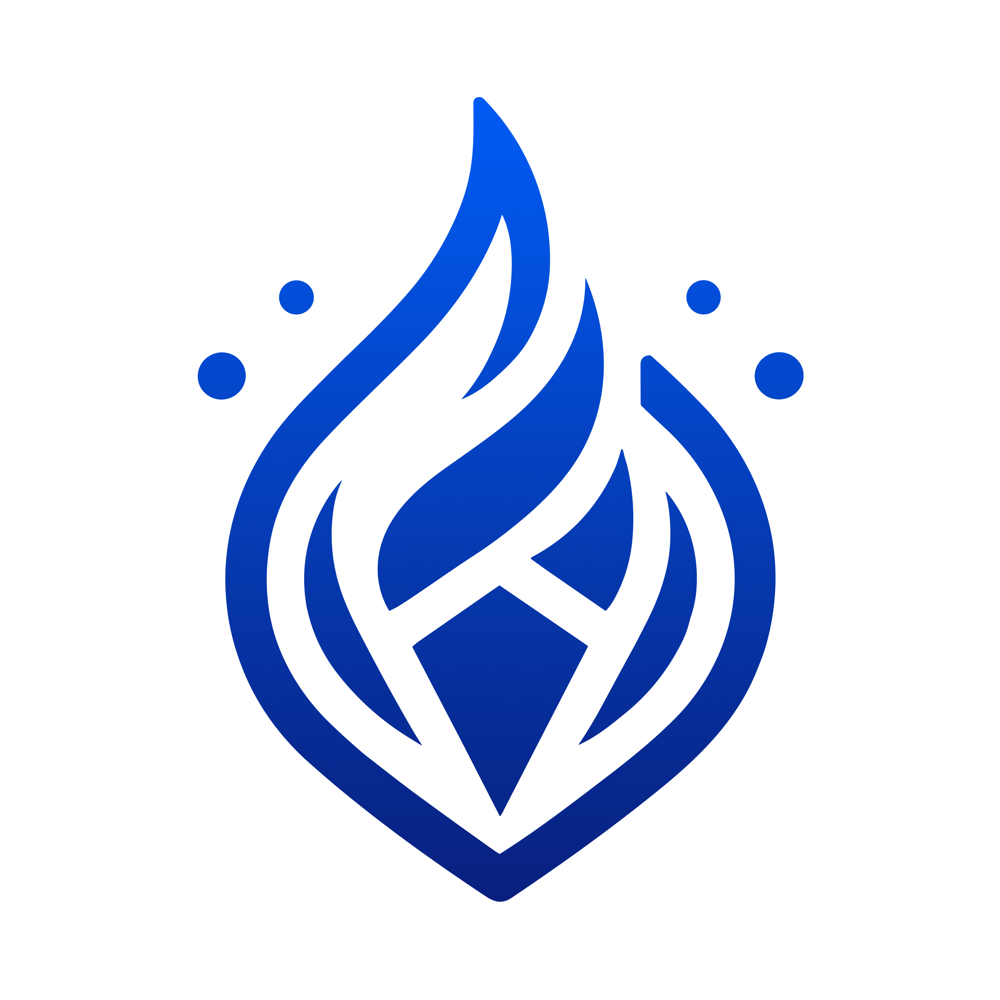
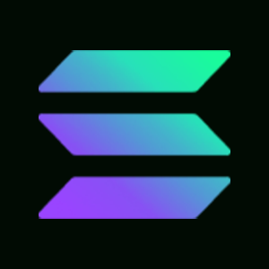
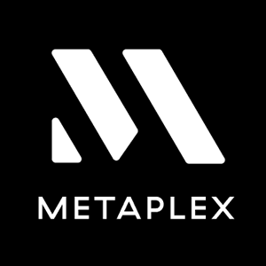
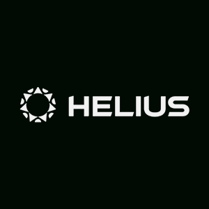

 

  

  <h3 align="center">Sapphire App</h3>

  

   The Sapphire App is an AI Image Generation aggregator and Solana blockchain integration system, combined with Community Image Sharing. Users can purchase Sapphires(credits) using USDC or SOL tokens to be used to generate images using one of three current AI Image Generators.

Generators:
 
Dalle-3 - Text to Image
 
Leonardo AI - Text to Image (Image to Image coming soon)
 
Stability AI - Image to Image

Users have the option to mint an NFT (standard and collection (pnft/cnft coming soon)) on the Solana blockchain of their generations.
 
Note This Project Is Still W.I.P
 
 
 
 

<a href="https://github.com/TombLabs/sapphire-hackathon/issues">Request Feature</a>

  

## Features

- Login with Google/Discord/X/Solana Wallet
- Purchase Sapphires with USDC/SOL/ANY JUP SWAPPABLE TOKEN
- Generate Images with Dalle-3/Leonardo AI/Stability AI
- Mint Creations to Solana via cNFTS, pNFTS, STandard NFTS, Collection NFTS
- Share Creations with the Community
- Mint CNFTs of community creations (Creator receives 50% of small minting fee)
- Tip other creators in SOL or Sapphires
- Featured Creators
- Burn NFTs for Sapphires
- All Creations Stored on Decentralized Storage
- Auctions for your creations as NFTs
- Proprietary Badge Program for on chain achievements
- Discord Bot Intergration

## Table Of Contents

- [Table Of Contents](#table-of-contents)
- [About The Project](#about-the-project)
- [Built With](#built-with)

- [Acknowledgements](#acknowledgements)

## About The Project

AI image generation revolutionizes the way that we create, customize and interact with visual content. Sapphire app aims to make this technology more accessible and efficient while harnessing the power of the Solana blockchain to provide a decentralized and secure platform for anyone to create and share their AI art.

Tomb Labs is committed to exploring the potential of AI beyond image generation and will be seeking to expand the connection between AI and the Solana blockchain going forward!

## Built With

We proudly build with the following technologies:

## Authors

- **Tomb Labs** - Development Team for TombStoned

## Acknowledgements

- [TombStoned](https://tombstoned.app/)
